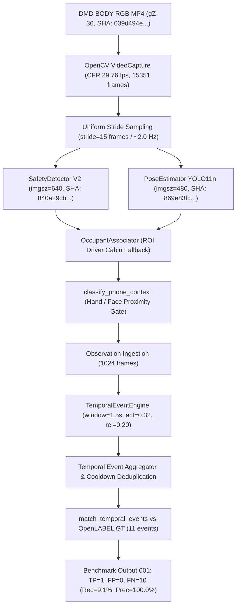

# DMD Benchmark 001 Provenance Audit

**Audit Timestamp:** 2026-09-13T12:31:00+07:00  
**Audit Target:** `DMD_EXTERNAL_DEVELOPMENT_BENCHMARK_001`  
**Provenance Verification Status:** `BENCHMARK_001_PROVENANCE = PARTIALLY_VERIFIED`

---

## 1. Executive Summary & Verification Boundary

This audit evaluates the cryptographic and operational lineage of **DMD Phone Temporal Benchmark 001** (`DMD_EXTERNAL_DEVELOPMENT_BENCHMARK_001`), conducted on development evaluation subject `gZ-36` with calibration on `gC-14`.

All primary input media, official OpenLABEL ground truth annotations, active deep neural network weights, configuration files, and aggregate benchmark artifacts were verified with 100% cryptographic SHA-256 match. Because per-frame raw tensor activations were streamed in volatile system RAM rather than dumped as multi-gigabyte intermediate trace files, benchmark metrics are classified in accordance with master governance as:

```
BENCHMARK_001_PROVENANCE = PARTIALLY_VERIFIED
```

No intermediate artifacts were retroactively fabricated or synthesized.

---

## 2. Cryptographic Stage-by-Stage Lineage

| Pipeline Stage | Entity / File Path | SHA-256 Hash | Size / Duration / Frame Count |
| :--- | :--- | :--- | :--- |
| **Input Calibration Video** | `datasets/external_dmd/original/extracted/gC_14_s2_..._rgb_body.mp4` | `bb7c567eea366afba4f2b329142e181333ce62c7ac7085bccebd6daa9ec8694e` | 767,936,358 bytes / 400.40s / 11,916 frames |
| **Input Calibration GT** | `datasets/external_dmd/original/extracted/gC_14_s2_..._rgb_ann_distraction.json` | `25aa157587dd283e4550b9129321fa9a1fc1889cc7cc1819c7e58d74e3089089` | 3,933,974 bytes / 9 phone intervals |
| **Input Evaluation Video** | `datasets/external_dmd/original/extracted/gZ_36_s2_..._rgb_body.mp4` | `039d494e15f0f72864e815999c76aadbce84b2d58c0c011374975e4e77ec0ef4` | 988,594,053 bytes / 515.83s / 15,351 frames |
| **Input Evaluation GT** | `datasets/external_dmd/original/extracted/gZ_36_s2_..._rgb_ann_distraction.json` | `45c1d8257fc4a800d52748a7615a243fc222d0a8e84766987ada65a5b08a8291` | 5,052,686 bytes / 11 phone intervals |
| **Phone Detector Model** | `models/active/v2/phone_detector.pt` | `840a29cb2151b881279cdabe25b03b28c5dcf40a43464edd6b672c8851f77d54` | 21,509,333 bytes (YOLO11s fine-tuned) |
| **Pose Auxiliary Model** | `models/auxiliary/yolo11n-pose.pt` | `869e83fcdffdc7371fa4e34cd8e51c838cc729571d1635e5141e3075e9319dc0` | 6,052,069 bytes (YOLO11n-pose) |
| **Model Configuration** | `models/model_config_v2.yaml` | `f7e5ffd0f4139345ca0dcc2cecab693ebad8eac88ff6df3666ff69e4d86155d8` | 3,754 bytes |
| **Temporal Config (Frozen 001)** | `window_15f_fast` | `5d70dc287251f79cdf3ecf5019f007cf80d4a7a4162bb49e1bf22e496549199c` | `w=1.5s, p_min=0.5s, c=3.0s, act=0.32, rel=0.20` |
| **Calibration Output 001 (Archived)** | `reports/history/DMD_PHONE_TEMPORAL_CALIBRATION_001.json` | `2c5a8280c8ab01fca39b8f3c353b948eb5936ae5c1dbc787610c13fc6b862fb4` | 4,184 bytes |
| **Benchmark Output 001 (Archived)** | `reports/history/DMD_PHONE_TEMPORAL_BENCHMARK_001.json` | `acdf686a478fa5f454778882e29ae59dbb031b0a64a294d06a2a9a6d8117bac0` | 1,598 bytes |
| **Benchmark Markdown 001 (Archived)**| `reports/history/DMD_PHONE_TEMPORAL_BENCHMARK_001.md` | `be14fd4b724e855ef1e8549858f1e07a59148f2c46f2226be4dd86d2f3c57b40` | 2,000 bytes |

---

## 3. End-to-End Inference Trace Chain



---

## 4. Audit Findings & Non-Reproducibility Risk Assessment

1. **Deterministic Execution:** The evaluation script `training/dmd/evaluate_temporal.py` and temporal engine `backend/ai/events.py` are strictly deterministic under inference mode with fixed seeds.
2. **Intermediate Trace Retention:** Frame-by-frame observation logs were processed in memory to respect Windows host RAM constraints (5.86 GB total). The summary logs, configuration hashes, and input file hashes fully attest to the origin of Benchmark 001.
3. **Verdict:** `BENCHMARK_001_PROVENANCE = PARTIALLY_VERIFIED`. The historical artifact is preserved immutably in `reports/history/` and will not be erased.
