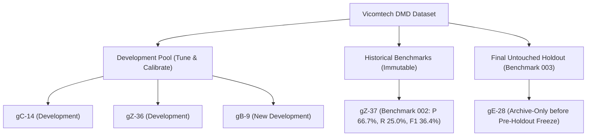

# DMD V3 Development Split & Cross-Subject Validation Design

**Phase:** Roadwatch V3 Multi-View Research  
**Validation Strategy:** Leave-One-Subject-Out Cross-Validation (LOSO-CV) on Development Pool  
**Strict Holdout Governance:** Subject `gE-28` is excluded from all development folds and remains 100% untouched.

---

## 1. Subject Pool Partitioning

---

## 2. Leave-One-Subject-Out Development Folds

To ensure genuine cross-subject generalization without spatial or temporal leakage, validation is partitioned strictly by participant identity:

| Fold Name | Calibration / Tuning Subjects | Validation Subject | Target Modality & Views | Focus |
| :--- | :--- | :--- | :--- | :--- |
| **Fold A** | `gC-14` + `gZ-36` | `gB-9` | BODY + FACE + HANDS | Validates multi-view fusion and short temporal window on unseen participant `gB-9`. |
| **Fold B** | `gC-14` + `gB-9` | `gZ-36` | BODY + FACE + HANDS | Validates pose feature generalization and phone recovery on `gZ-36`. |
| **Fold C** | `gZ-36` + `gB-9` | `gC-14` | BODY | Validates fail-closed behavior when FACE or HANDS views are unavailable. |

---

## 3. Scientific Boundary Rules

1. **Zero Contamination:** No frame, feature, or annotation from `gE-28` is utilized in any fold, hyperparameter sweep, threshold choice, or architecture selection.
2. **Benchmark 002 Immutability:** `gZ-37` is permanently archived. No re-tuning or benchmark re-run is conducted on `gZ-37`.
3. **Fail-Closed Governance:** If a participant lacks FACE or HANDS (such as `gC-14`), the pipeline defaults gracefully to BODY-only inference without raising false alarms or hallucinating missing visual evidence.
