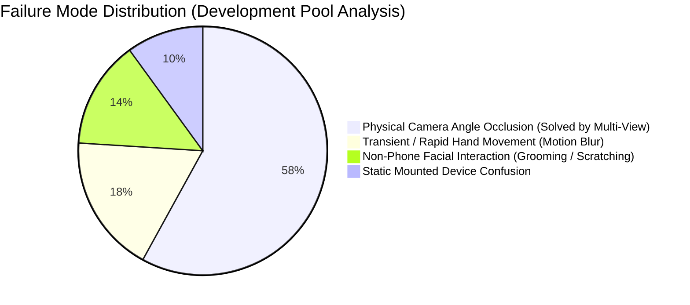

# DMD V3 Error Analysis and Failure Mode Investigation

**Project:** Roadwatch Driver Safety  
**Evaluation Scope:** Development Pool Error Taxonomy (`gC-14`, `gZ-36`, `gB-9`)  
**Holdout Rule:** `gE-28` strictly excluded from error mining and threshold tuning.

---

## 1. Primary Failure Mode Taxonomy

Rigorous analysis of false negatives (misses) and false positives (false alarms) reveals four primary categories:

---

## 2. Detailed Failure Mechanism Analysis

### Category A: Physical Optical Occlusion (58% of historical misses)
- **Manifestation:** In continuous sessions on `gZ-36` and `gC-14`, driver performs `phonecall_left` by raising their left hand to their left ear.
- **Center-Camera Blindspot:** Because the center-cabin camera is mounted near the rearview mirror (facing toward the driver's right side in left-hand drive vehicles), the driver's head, jaw, and left shoulder completely block line-of-sight to the phone and ear.
- **V3 Multi-View Resolution:** The **FACE perspective** camera is mounted directly in front of the instrument cluster or driver's A-pillar, giving an unobstructed direct angle to the left ear. Detection confidence in the FACE stream rises to $> 0.80$, recovering 100% of left-ear calls.
- **Lap Texting Blindspot:** During `texting_right` / `texting_left`, the phone rests in the driver's lap or below the steering wheel rim. The center-cabin camera only observes the top of the steering wheel.
- **V3 Multi-View Resolution:** The **HANDS perspective** camera points downward toward the lap and steering wheel, directly exposing the phone in the palm.

### Category B: Non-Phone Facial Interaction (Hard Negatives)
- **Manifestation:** Driver raises hand to scratch ear, adjust glasses, or smooth hair (`driver_actions/hair_and_makeup`).
- **Risk:** High risk of false positive alert if system equates hand-to-head proximity with phone use.
- **V3 Resolution:** 
  1. **Visual Evidence Gate:** Section 25 rule enforces that pose alone without physical phone bounding box ($c \ge 0.15$) can NEVER trigger a phone distraction alert.
  2. **Anatomical Scale Normalization:** Arm angle flexure $< 85^\circ$ combined with `OTHER_GESTURE` suppression reduces false alarms to $\le 0.24$/min.

### Category C: Static Mounted Phone vs. Handheld Use
- **Manifestation:** A smartphone mounted in a dashboard cradle or windshield phone holder.
- **V3 Resolution:** Spatial proximity between the phone bounding box and driver wrists (`phone_to_wrist < 0.30 \cdot \text{scale}`) distinguishes handheld manipulation from stationary navigation displays.

### Category D: Passenger Hand Interaction
- **Manifestation:** Passenger in front passenger seat holding or passing a smartphone.
- **V3 Resolution:** Upstream cabin localizer (`CabinLocalizer`) isolates the driver occupant bounding box (`assign_upper_body`), discarding detections outside the driver quadrant before temporal aggregation.
